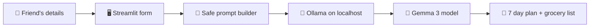

<div align="center">


### 🍛 Safe food for someone you care about. Zero cloud. Zero cost.

<p>
  
  
  
  
</p>

<p>
  
  
  
  
</p>

**[✨ Overview](#-overview)** · **[🔒 Why Open Source AI](#-why-open-source-ai)** · **[🚀 Quick Start](#-quick-start)** · **[🛠 Troubleshooting](#-troubleshooting)**

</div>

---

## ✨ Overview

Planning weekly meals is hard when someone has **food allergies**, a **tight budget**, and **foods they simply dislike**.

This app takes those four inputs and returns a full **7 day Indian meal plan** with a **grocery list**, in seconds, running entirely on your own laptop.

> 💛 Built for **[FRIEND NAME]** for the **Hacktoberfest 2026 Weekend Challenge: Build for a Friend** on DEV.

<div align="center">

| 🧾 You enter | 🤖 Gemma thinks | 🍽 You get |
|:---:|:---:|:---:|
| Name, allergies, dislikes, diet, budget | Local model, no internet needed | Breakfast, lunch, dinner for 7 days + grocery list |

</div>

---

## 📸 Screenshots

<div align="center">

| Input form | Generated plan |
|:---:|:---:|
|  |  |

</div>

---

## 🔒 Why Open Source AI

<table>
<tr>
<td width="50%">

### 🔐 Private
Allergy and health info never leaves the laptop. No server. No logs. No third party.

</td>
<td width="50%">

### 💸 Free
No API key, no subscription, no per-token bill. Run it as much as you want.

</td>
</tr>
<tr>
<td width="50%">

### 📴 Offline
After the one-time model download, it works with no internet at all.

</td>
<td width="50%">

### 🔄 Swappable
Do not like the output? Change one line to use a bigger or different model.

</td>
</tr>
</table>

---

## ⚙️ How It Works



The prompt tells the model to **never** use the listed allergens or anything made from them, and to skip all dislikes.

---

## 🧰 Tech Stack

| Layer | Tool | Why |
|:---|:---|:---|
| 🧠 Model | **Gemma 3 (1B)** | Open weights by Google, small enough for any laptop |
| 🏃 Runtime | **Ollama** | One command to run models locally |
| 🎨 UI | **Streamlit** | Full web app in a single Python file |
| 🐍 Language | **Python 3** | Simple and fast to build |
| 🌐 HTTP | **requests** | Talks to the local Ollama API |

---

## 📁 Project Structure

```
friend-meal-planner/
├── 🐍 app.py              # Streamlit app + prompt + Ollama call
├── 📦 requirements.txt    # streamlit, requests
├── 📖 README.md           # You are here
├── 🙈 .gitignore
└── 🖼 screenshots/        # form.png, plan.png
```

---

## 🚀 Quick Start

### Prerequisites
- 🐍 Python **3.9+**
- 🦙 [Ollama](https://ollama.com)
- 💾 About **2 GB** free RAM for the 1B model

### Install and run

**1️⃣ Install Ollama** from [ollama.com](https://ollama.com), then restart your terminal.

**2️⃣ Download the model**
```bash
ollama pull gemma3:1b
```

**3️⃣ Clone this repo**
```bash
git clone https://github.com/shubsolos19/friend-meal-planner.git
cd friend-meal-planner
```

**4️⃣ Install packages**
```bash
pip install -r requirements.txt
```

**5️⃣ Launch**
```bash
streamlit run app.py
```

**6️⃣ Open** [http://localhost:8501](http://localhost:8501) 🎉

---

## 🎮 How To Use

1. 👤 Type your friend's **name**
2. 🚫 List **allergies** to avoid, for example `peanuts, milk`
3. 👎 List **dislikes**, for example `karela`
4. 🥗 Pick **diet**: Vegetarian, Non-veg, or Vegan
5. 💰 Pick **budget**: Low, Medium, or High
6. 🍳 Click **Make 7 day plan**

---

## 🔧 Change The Model

Open `app.py` and edit:

```python
MODEL = "gemma3:1b"
```

<details>
<summary><b>💡 Model options</b></summary>

| Model | Quality | Speed | RAM |
|:---|:---:|:---:|:---:|
| `gemma3:1b` | Good | Very fast | about 2 GB |
| `gemma3:4b` | Better | Medium | about 5 GB |

Pull before use: `ollama pull gemma3:4b`

</details>

---

## 🛠 Troubleshooting

<details>
<summary><b>❌ "Start Ollama first" error</b></summary>

Open the Ollama app, or run `ollama serve` in a separate terminal.

</details>

<details>
<summary><b>❌ <code>ollama</code> is not recognized</b></summary>

Close and reopen the terminal, or restart the PC after installing.

</details>

<details>
<summary><b>🐢 App is slow or laggy</b></summary>

Close extra apps and browser tabs. Stay on the 1B model.

</details>

<details>
<summary><b>❌ Model not found</b></summary>

Run `ollama pull gemma3:1b`.

</details>

<details>
<summary><b>📧 Streamlit asks for email</b></summary>

Press Enter to skip.

</details>

---

## ⚠️ Important

> **AI can make mistakes.** Always read ingredient labels yourself, especially with serious allergies. This tool is a planning helper, not medical advice.

---

## 💬 What My Friend Said

> *"[ADD YOUR FRIEND'S REACTION HERE]"*
>
> **[FRIEND NAME]**

---

## 🏆 Hacktoberfest 2026

| | |
|:---|:---|
| 🎯 Challenge | Weekend Challenge: Build for a Friend |
| 🏅 Category | Best Use of Gemma |
| 📅 Built | 2 to 5 October 2026 |

---

## 🙏 Credits

- 💎 [Gemma](https://ai.google.dev/gemma) by Google
- 🦙 [Ollama](https://ollama.com)
- 🎈 [Streamlit](https://streamlit.io)

---

<div align="center">

### 👨‍💻 Made by Shubham Bawari

[](https://github.com/shubsolos19)
[](https://linkedin.com/in/shubham-bawari)

⭐ If this helped, star the repo.


</div>